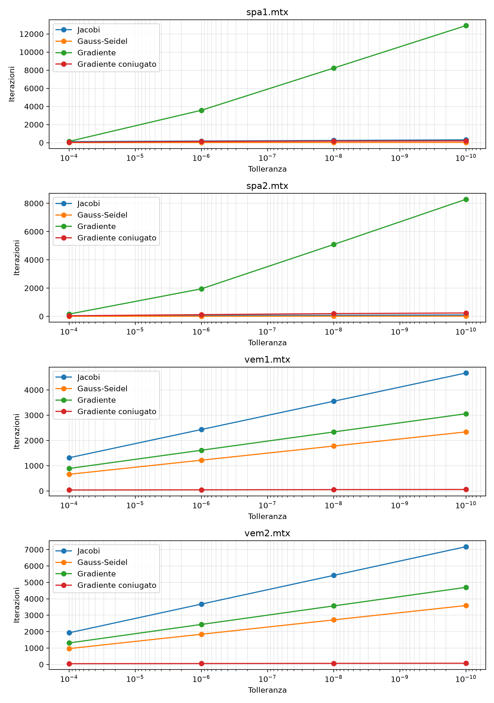
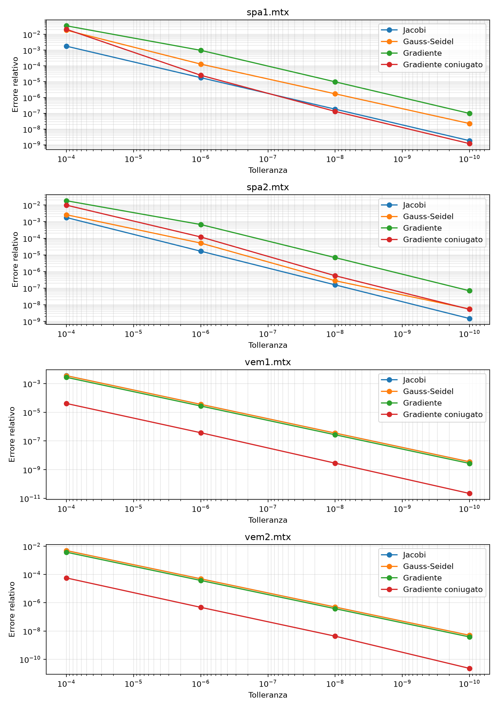
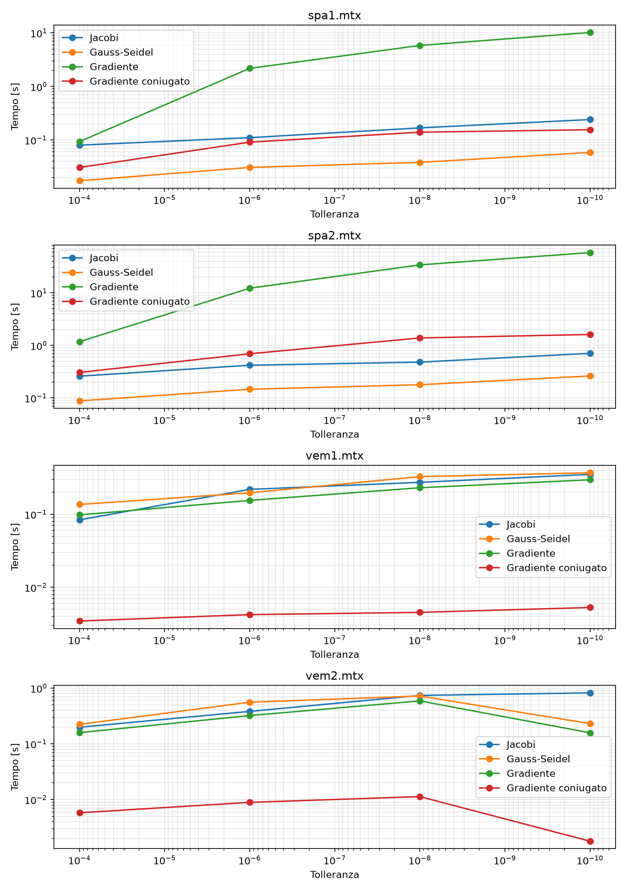

# Relazione — Mini libreria per sistemi lineari (metodi iterativi)

**Metodi del Calcolo Scientifico — AA 2025-2026, Progetto 1 (alternativo)**

Implementazione e validazione di quattro solutori iterativi (Jacobi,
Gauss-Seidel, Gradiente, Gradiente coniugato) per sistemi lineari `A x = b`
con `A` simmetrica e definita positiva (SPD).

---

## 1. Struttura della libreria

Il progetto è scritto in **Python**. Per le sole **strutture dati** (matrice
sparsa CSR, vettori) e le **operazioni elementari** (prodotto matrice-vettore
`A@x`, prodotto scalare, norma) ci si appoggia a `scipy.sparse`/`numpy`, come
consentito dalla consegna. **Gli algoritmi risolutivi sono interamente
implementati nel progetto** (`solvers.py`): non viene usato alcun solutore di
sistemi lineari di scipy/numpy.

```
assignment1MCS/
├── solvers.py            # i 4 metodi + criterio di arresto + sweep GS (numba)
├── run_assignment.py     # eseguibile: matrici + tolleranze -> risultati + CSV
├── plot_results.py       # generazione grafici
├── test_assignment.py    # test automatici
├── analyze_cond.py       # stima di cond(A) (solo per i commenti)
├── dati/                 # spa1, spa2, vem1, vem2 (.mtx)
├── results/              # results.csv + plots/*.png
├── Teoria.md             # documento teorico divulgativo
├── Relazione.md          # questo documento
└── README.md
```

### 1.1 Architettura

La libreria **non è una sequenza di funzioni indipendenti**, ma una piccola
gerarchia di classi coesa, costruita su un'osservazione delle dispense: tutti i
metodi condividono lo stesso scheletro (Algoritmo 6) e differiscono *solo* nel
passo di aggiornamento `x⁽ᵏ⁾ → x⁽ᵏ⁺¹⁾`.

- **`IterativeSolver`** (classe base astratta) implementa **una sola volta** lo
  scheletro comune nel metodo `solve()`: vettore iniziale nullo `x⁽⁰⁾ = 0`;
  ciclo che si arresta quando il residuo scalato `‖b − A x⁽ᵏ⁾‖/‖b‖ < tol`,
  oppure quando si superano `max_iter` iterazioni (segnalando la non
  convergenza); validazione, misura del tempo, costruzione del risultato.

  ```
  x⁽⁰⁾ = 0
  finché   ‖b − A x⁽ᵏ⁾‖ / ‖b‖ ≥ tol   e   k < max_iter:
      x⁽ᵏ⁺¹⁾ = aggiornamento(x⁽ᵏ⁾)
      k += 1
  ```

- **`_Iteration`** (interfaccia astratta) incapsula lo stato e il *passo* di un
  metodo (pattern *template method*). Le quattro classi concrete — `Jacobi`,
  `GaussSeidel`, `Gradient`, `ConjugateGradient` — forniscono soltanto la propria
  regola di aggiornamento. Aggiungere un quinto metodo significa scrivere una
  sola classe, senza toccare lo scheletro.
- **`SolverResult`** (dataclass) raccoglie in modo uniforme l'esito: soluzione,
  iterazioni, tempo, residuo relativo finale, convergenza.

Le istanze dei quattro metodi sono raccolte nella tupla `SOLVERS`, su cui
iterano sia il runner sia i test. Le parti di servizio comuni sono fattorizzate
(`_validate_for_iteration`: matrice quadrata e diagonale non nulla; `_safe_norm`:
norma di `b`, calcolata una sola volta).

### 1.2 Note implementative rilevanti

- **Sparsità preservata.** Nessun metodo fattorizza o modifica `A`: la matrice è
  usata solo per prodotti `A·v`, il cui costo è proporzionale al numero di
  non-zeri e non a `n²` (niente *fill-in*).
- **Un solo matvec per iterazione.** Per Jacobi, Gradiente e Gradiente coniugato
  il residuo successivo si ottiene con la ricorrenza `r⁽ᵏ⁺¹⁾ = r⁽ᵏ⁾ − α A·v`,
  evitando un prodotto matrice-vettore in più.
- **Gauss-Seidel senza inversa, ma veloce.** Il passo `P⁻¹ r` (con
  `P = D + L` triangolare inferiore) è realizzato con una *sweep* in place che
  aggiorna `x⁽ᵏ⁺¹⁾` riusando i valori appena calcolati — equivalente a una
  sostituzione in avanti — **senza mai costruire `P⁻¹`**. Essendo
  intrinsecamente sequenziale (`x[i]` dipende da `x[0..i-1]`), è compilata con
  **numba** (`_gauss_seidel_sweep`), restando codice nostro: così non è il collo
  di bottiglia che sarebbe un ciclo Python puro.
- **Tempi equi.** Prima delle misure si esegue un *warm-up* che forza la
  compilazione JIT, così il tempo di Gauss-Seidel non include il costo (una
  tantum) di compilazione.

---

## 2. Metodologia di validazione

Procedura standard richiesta dalla consegna (step 1–4), per ogni matrice:

1. soluzione esatta `x = [1, 1, …, 1]`;
2. termine noto `b = A x`;
3. risoluzione con i quattro metodi a partire da `x⁽⁰⁾ = 0`;
4. misura di **errore relativo** `‖x_calc − x‖/‖x‖`, **iterazioni** e **tempo**.

- Tolleranze: `tol ∈ {1e-4, 1e-6, 1e-8, 1e-10}`.
- `max_iter = 20000`.
- Criterio di arresto: residuo scalato `‖b − A x⁽ᵏ⁾‖/‖b‖ < tol`.

**Ambiente di calcolo** (lo stesso per tutti i test): Intel Core i7-1165G7
@ 2.80 GHz, 16 GB RAM, Windows 11, Python 3.12.10, numpy 2.4.6, scipy 1.18.0,
numba 0.65.1.

### 2.1 Le matrici di test

| Matrice | `n` | non-zeri | `λ_min` | `λ_max` | `cond(A) = λ_max/λ_min` |
|---|---:|---:|---:|---:|---:|
| spa1 | 1000 | 182 434 | 4.88e-01 | 9.99e+02 | **2.05e+03** |
| spa2 | 3000 | 1 633 298 | 2.12e+00 | 3.00e+03 | **1.41e+03** |
| vem1 | 1681 | 13 385 | 1.23e-02 | 4.00e+00 | **3.25e+02** |
| vem2 | 2601 | 21 225 | 7.89e-03 | 4.00e+00 | **5.07e+02** |

(`λ` e `cond(A)` stimati con `analyze_cond.py`.) Le `spa*` sono molto più dense
(≈180 e ≈540 non-zeri per riga) e con condizionamento maggiore; le `vem*` sono
molto più sparse (≈8 non-zeri per riga) e meglio condizionate.

---

## 3. Risultati

Tabelle complete (estratte da `results/results.csv`). Tutti i metodi sono
arrivati a convergenza (`conv = sì`) entro `max_iter = 20000`.

### spa1 — n = 1000, nnz = 182 434

| tol | metodo | iter | err. rel. | res. scal. | t [s] |
|---|---|---:|---:|---:|---:|
| 1e-04 | Jacobi | 115 | 1.77e-03 | 9.48e-05 | 0.055 |
| 1e-04 | Gauss-Seidel | 9 | 1.82e-02 | 7.79e-05 | 0.017 |
| 1e-04 | Gradiente | 143 | 3.46e-02 | 9.91e-05 | 0.075 |
| 1e-04 | Gradiente coniugato | 49 | 2.08e-02 | 9.78e-05 | 0.028 |
| 1e-06 | Jacobi | 181 | 1.80e-05 | 9.62e-07 | 0.090 |
| 1e-06 | Gauss-Seidel | 17 | 1.30e-04 | 5.58e-07 | 0.026 |
| 1e-06 | Gradiente | 3577 | 9.68e-04 | 9.98e-07 | 2.155 |
| 1e-06 | Gradiente coniugato | 134 | 2.55e-05 | 9.74e-07 | 0.060 |
| 1e-08 | Jacobi | 247 | 1.82e-07 | 9.76e-09 | 0.100 |
| 1e-08 | Gauss-Seidel | 24 | 1.71e-06 | 7.34e-09 | 0.026 |
| 1e-08 | Gradiente | 8233 | 9.82e-06 | 9.99e-09 | 4.767 |
| 1e-08 | Gradiente coniugato | 177 | 1.32e-07 | 9.03e-09 | 0.172 |
| 1e-10 | Jacobi | 313 | 1.85e-09 | 9.91e-11 | 0.261 |
| 1e-10 | Gauss-Seidel | 31 | 2.25e-08 | 9.65e-11 | 0.074 |
| 1e-10 | Gradiente | 12919 | 9.82e-08 | 9.99e-11 | 10.451 |
| 1e-10 | Gradiente coniugato | 200 | 1.20e-09 | 7.94e-11 | 0.162 |

### spa2 — n = 3000, nnz = 1 633 298

| tol | metodo | iter | err. rel. | res. scal. | t [s] |
|---|---|---:|---:|---:|---:|
| 1e-04 | Jacobi | 36 | 1.77e-03 | 9.54e-05 | 0.261 |
| 1e-04 | Gauss-Seidel | 5 | 2.60e-03 | 4.14e-05 | 0.090 |
| 1e-04 | Gradiente | 161 | 1.81e-02 | 9.90e-05 | 1.167 |
| 1e-04 | Gradiente coniugato | 42 | 9.82e-03 | 9.91e-05 | 0.311 |
| 1e-06 | Jacobi | 57 | 1.67e-05 | 9.00e-07 | 0.422 |
| 1e-06 | Gauss-Seidel | 8 | 5.14e-05 | 7.85e-07 | 0.132 |
| 1e-06 | Gradiente | 1949 | 6.69e-04 | 9.99e-07 | 11.711 |
| 1e-06 | Gradiente coniugato | 122 | 1.20e-04 | 9.09e-07 | 0.929 |
| 1e-08 | Jacobi | 78 | 1.57e-07 | 8.49e-09 | 0.594 |
| 1e-08 | Gauss-Seidel | 12 | 2.79e-07 | 4.27e-09 | 0.229 |
| 1e-08 | Gradiente | 5087 | 6.87e-06 | 9.98e-09 | 34.293 |
| 1e-08 | Gradiente coniugato | 196 | 5.59e-07 | 9.60e-09 | 1.359 |
| 1e-10 | Jacobi | 99 | 1.48e-09 | 8.01e-11 | 0.718 |
| 1e-10 | Gauss-Seidel | 15 | 5.57e-09 | 8.52e-11 | 0.300 |
| 1e-10 | Gradiente | 8285 | 6.94e-08 | 9.99e-11 | 51.517 |
| 1e-10 | Gradiente coniugato | 240 | 5.32e-09 | 9.82e-11 | 1.238 |

### vem1 — n = 1681, nnz = 13 385

| tol | metodo | iter | err. rel. | res. scal. | t [s] |
|---|---|---:|---:|---:|---:|
| 1e-04 | Jacobi | 1314 | 3.54e-03 | 9.99e-05 | 0.060 |
| 1e-04 | Gauss-Seidel | 659 | 3.51e-03 | 9.93e-05 | 0.093 |
| 1e-04 | Gradiente | 890 | 2.70e-03 | 9.93e-05 | 0.072 |
| 1e-04 | Gradiente coniugato | 38 | 4.08e-05 | 7.11e-05 | 0.002 |
| 1e-06 | Jacobi | 2433 | 3.54e-05 | 9.99e-07 | 0.178 |
| 1e-06 | Gauss-Seidel | 1218 | 3.53e-05 | 9.99e-07 | 0.177 |
| 1e-06 | Gradiente | 1612 | 2.71e-05 | 9.97e-07 | 0.139 |
| 1e-06 | Gradiente coniugato | 45 | 3.73e-07 | 8.90e-07 | 0.003 |
| 1e-08 | Jacobi | 3552 | 3.54e-07 | 9.99e-09 | 0.237 |
| 1e-08 | Gauss-Seidel | 1778 | 3.52e-07 | 9.96e-09 | 0.250 |
| 1e-08 | Gradiente | 2336 | 2.70e-07 | 9.90e-09 | 0.164 |
| 1e-08 | Gradiente coniugato | 53 | 2.83e-09 | 7.80e-09 | 0.007 |
| 1e-10 | Jacobi | 4671 | 3.54e-09 | 9.99e-11 | 0.311 |
| 1e-10 | Gauss-Seidel | 2338 | 3.51e-09 | 9.94e-11 | 0.330 |
| 1e-10 | Gradiente | 3058 | 2.71e-09 | 9.97e-11 | 0.241 |
| 1e-10 | Gradiente coniugato | 59 | 2.19e-11 | 6.91e-11 | 0.005 |

### vem2 — n = 2601, nnz = 21 225

| tol | metodo | iter | err. rel. | res. scal. | t [s] |
|---|---|---:|---:|---:|---:|
| 1e-04 | Jacobi | 1927 | 4.97e-03 | 9.99e-05 | 0.130 |
| 1e-04 | Gauss-Seidel | 965 | 4.95e-03 | 9.98e-05 | 0.179 |
| 1e-04 | Gradiente | 1308 | 3.81e-03 | 9.98e-05 | 0.126 |
| 1e-04 | Gradiente coniugato | 47 | 5.73e-05 | 9.19e-05 | 0.005 |
| 1e-06 | Jacobi | 3676 | 4.97e-05 | 9.99e-07 | 0.321 |
| 1e-06 | Gauss-Seidel | 1840 | 4.94e-05 | 9.96e-07 | 0.357 |
| 1e-06 | Gradiente | 2438 | 3.79e-05 | 9.92e-07 | 0.194 |
| 1e-06 | Gradiente coniugato | 56 | 4.74e-07 | 8.54e-07 | 0.004 |
| 1e-08 | Jacobi | 5425 | 4.97e-07 | 9.99e-09 | 0.451 |
| 1e-08 | Gauss-Seidel | 2714 | 4.96e-07 | 9.99e-09 | 0.484 |
| 1e-08 | Gradiente | 3566 | 3.81e-07 | 9.97e-09 | 0.381 |
| 1e-08 | Gradiente coniugato | 66 | 4.30e-09 | 8.60e-09 | 0.008 |
| 1e-10 | Jacobi | 7174 | 4.96e-09 | 9.98e-11 | 0.835 |
| 1e-10 | Gauss-Seidel | 3589 | 4.95e-09 | 9.97e-11 | 0.891 |
| 1e-10 | Gradiente | 4696 | 3.80e-09 | 9.94e-11 | 0.373 |
| 1e-10 | Gradiente coniugato | 74 | 2.25e-11 | 5.90e-11 | 0.007 |

### Grafici di sintesi







(asse `tol` decrescente da sinistra a destra; errore e tempo in scala logaritmica)

---

## 4. Commenti

**Tutti e quattro i metodi convergono** su tutte le matrici e tutte le
tolleranze, entro `max_iter = 20000`. Le matrici di test sono quindi "trattabili"
anche dai metodi più semplici. Emergono comunque comportamenti molto diversi.

**1) Gauss-Seidel converge sempre in circa metà delle iterazioni di Jacobi.**
È esattamente quanto previsto dalla teoria: riusando immediatamente le componenti
appena calcolate fa più "lavoro utile" per iterazione. Es. vem2 @1e-8: Jacobi
5425 vs Gauss-Seidel 2714 iterazioni (rapporto ≈ 2.0). Il singolo passo di
Gauss-Seidel è un po' più costoso (sweep sequenziale), perciò sulle matrici
molto sparse `vem` i tempi totali dei due metodi si equivalgono, mentre sulle
`spa` (dove GS converge in pochissime iterazioni) GS è nettamente il più rapido.

**2) Due "regimi" opposti tra le famiglie di matrici.** I metodi stazionari
(Jacobi/Gauss-Seidel) e quelli del gradiente rispondono a proprietà diverse
della matrice:
- Su **spa1/spa2** Jacobi e Gauss-Seidel sono fulminei (5–313 iterazioni),
  mentre il Gradiente è lentissimo (fino a ~12 900 iterazioni). Le `spa` sono
  fortemente *dominanti diagonali* → il raggio spettrale della matrice di
  iterazione è piccolo → metodi stazionari rapidi; ma hanno `cond(A) ≈ 2·10³`,
  e la velocità del Gradiente dipende proprio da `cond(A)`, da cui la lentezza.
- Su **vem1/vem2** la situazione si riequilibra: meno dominanza diagonale rende
  Jacobi/Gauss-Seidel più lenti (migliaia di iterazioni), mentre il minore
  `cond(A) ≈ 3–5·10²` rende il Gradiente competitivo.

Questo conferma che **la velocità di Jacobi/Gauss-Seidel è governata dalla
dominanza diagonale** (raggio spettrale di `P⁻¹N`), mentre quella di
**Gradiente/Gradiente coniugato è governata dal numero di condizionamento**.

**3) Il Gradiente coniugato è il metodo più robusto e regolare.** Converge
sempre in **poche decine di iterazioni** (38–240) indipendentemente dalla
matrice, con crescita lentissima al ridursi di `tol`. Il numero di iterazioni
scala come `√cond(A)` (coerente: spa1, `cond≈2·10³`, richiede più passi di vem1,
`cond≈3·10²`) ed è sempre ben al di sotto del limite teorico di `n` iterazioni.
È il vincitore netto sulle matrici mal condizionate `vem`.

**4) Residuo piccolo ≠ errore piccolo.** A parità di `tol`, l'errore relativo
sulla soluzione **non** è uguale fra i metodi e, per i metodi stazionari, vale
circa `tol × cost`, con `cost` legato al condizionamento (relazione
`errore ≲ cond(A) · residuo`). Esempi a `tol=1e-6`: su vem2 l'errore è ~5·10⁻⁵
(circa 50× il residuo); su spa1 il Gradiente ha errore ~10⁻³ (circa 1000× il
residuo). Il Gradiente coniugato raggiunge invece errori molto più piccoli (fino
a ~10⁻¹¹), perché tende a ridurre simultaneamente tutte le componenti spettrali
dell'errore.

**5) Tempi di calcolo.** In secondi assoluti il quadro dipende dalla densità:
- sulle `spa` (dense) il prodotto matrice-vettore è caro, quindi il Gradiente,
  che fa molte iterazioni, arriva a oltre 50 s (spa2 @1e-10), mentre
  Gauss-Seidel resta sotto 0.3 s e CG sotto 1.3 s;
- sulle `vem` (molto sparse) tutti i metodi sono rapidi (< 1 s); CG è comunque
  il più veloce in assoluto (≤ 0.008 s) grazie al bassissimo numero di
  iterazioni.

In sintesi, **su queste matrici il Gradiente coniugato è la scelta migliore in
ogni scenario**; tra i metodi stazionari, Gauss-Seidel domina Jacobi; il
Gradiente semplice è penalizzato quando la matrice è mal condizionata (effetto
"zig-zag").

---

## 5. Come eseguire

Requisiti: `pip install -r requirements.txt` (numpy, scipy, numba, matplotlib).

```bash
# validazione completa (tutte le matrici e tolleranze) -> results/
python run_assignment.py

# una matrice / una tolleranza / un metodo specifici
python run_assignment.py --matrix dati/vem1.mtx --tol 1e-8
python run_assignment.py --method conjugate-gradient

# test automatici
python test_assignment.py

# stima dei numeri di condizionamento (per i commenti)
python analyze_cond.py
```

`run_assignment.py` rigenera `results/results.csv` e i grafici in
`results/plots/`.

---

## 6. Conclusioni

La libreria implementa i quattro metodi richiesti con un'architettura coesa
(classe base con lo scheletro comune + una classe per metodo con la sola regola
di aggiornamento), rispettando il vincolo di usare la libreria di base solo per
strutture dati e operazioni elementari. La validazione conferma puntualmente la teoria:
Gauss-Seidel ≈ 2× più rapido di Jacobi in iterazioni; velocità dei metodi
stazionari legata alla dominanza diagonale e quella dei metodi del gradiente al
condizionamento; netta superiorità del Gradiente coniugato, sempre convergente
in poche decine di iterazioni e con gli errori più piccoli.
